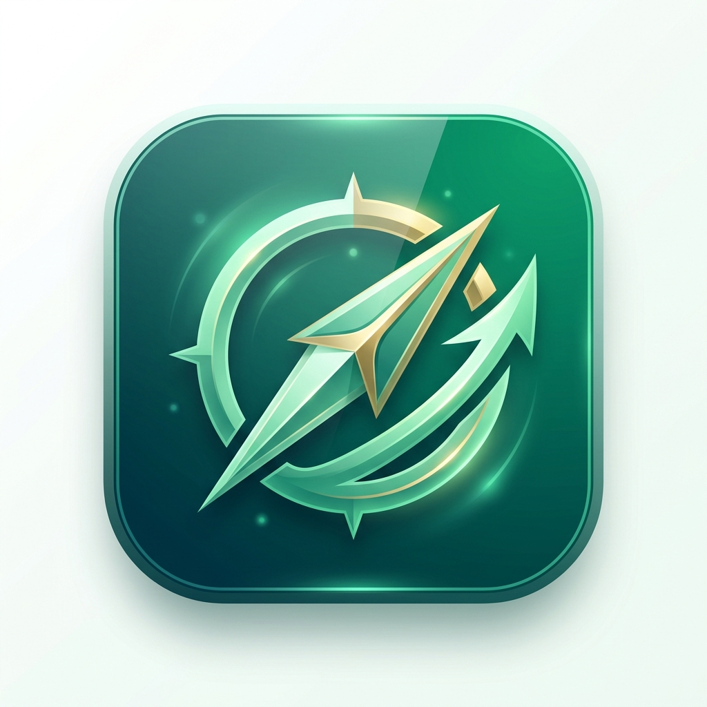

<div align="center">

  

  # مساري | MASARI
  ### منصة التوظيف الذكية التفاعلية لسوق العمل السعودي
  ### AI-Powered Smart Job Matching Platform for Saudi Arabia

  <p align="center">
    <a href="#-العربية"><strong>العربية</strong></a> •
    <a href="#-english"><strong>English</strong></a>
  </p>

  <p align="center">
    
    
    
    
    
    
  </p>
</div>

---

# 🇸🇦 العربية

## 📌 نبذة عن المشروع
**مساري (Masari)** هو تطبيق ويب تقدمي حديث مصمم خصيصاً لسوق العمل في المملكة العربية السعودية. يعيد التطبيق ابتكار تجربة البحث عن وظائف والتقديم عليها من خلال نظام سحب البطاقات التفاعلي (*Swipe-to-Apply*)، مدعوماً بخوارزمية مطابقة ذكية تقيس مدى توافق مهارات الباحث مع متطلبات الوظائف، مع مدرب مهني ذكي بالذكاء الاصطناعي لتوجيه المسار الوظيفي.

---

## ✨ المميزات الرئيسية

- **🃏 سحب البطاقات التفاعلي (Swipe Deck):** تصفح الوظائف بطريقة سريعة وممتعة — اسحب لليمين للتقديم الفوري، أو لليسار للتخطي، مع إمكانية التراجع.
- **🎯 خوارزمية قياس نسبة التطابق الذكي (AI Match Score):** احتساب نسبة التوافق (0–100%) بناءً على المهارات، المدينة، الراتب المتوقع، ونوع العمل مع توضيح أسباب التوافق ونقاط التطوير.
- **🧭 مدرب المسار المهني الذكي (AI Career Coach):** صياغة أهداف مهنية ذكية (SMART Goals) وتحديد المهارات المستقبلية المستهدفة.
- **📄 استخراج المهارات من السيرة الذاتية (CV Parsing):** رفع السيرة الذاتية واستخراج المهارات والخبرات آلياً لتجهيز الملف في ثوانٍ.
- **💬 المحادثات والمقابلات (Matches & Interviews):** إدارة الوظائف المقبولة، محاكاة المراسلة مع مسؤولي التوظيف، وتتبع مواعيد المقابلات.
- **🌐 دعم ثنائي كامل للغة (عربي / إنجليزي):** تبديل سلس بين اللغتين مع ضبط كامل لاتجاه الواجهة (RTL / LTR).
- **🌗 الوضع الليلي والنهاري (Light / Dark Mode):** تصميم عصري بهوية خضراء سعودية مستوحاة من ألوان الزمرد ودرجات OKLCH الحديثة.

---

## 📸 معرض الصور والشاشات

### 1. الشاشة الترحيبية وتجهيز الملف المهني (Onboarding)
<div align="center">
  <table border="0">
    <tr>
      <td align="center" width="50%">
        <br />
        <b>الشاشة الرئيسية والترحيب</b>
      </td>
      <td align="center" width="50%">
        <br />
        <b>رفع السيرة الذاتية وقراءة المهارات</b>
      </td>
    </tr>
  </table>
</div>

### 2. تصفح الوظائف ونسب التوافق (Job Discovery Deck)
<div align="center">
  <table border="0">
    <tr>
      <td align="center" width="50%">
        <br />
        <b>استكشاف الوظائف (الوضع الفاتح - عربي)</b>
      </td>
      <td align="center" width="50%">
        <br />
        <b>استكشاف الوظائف (الوضع الداكن - أرامكو السعودية)</b>
      </td>
    </tr>
  </table>
</div>

### 3. التطابقات والمقابلات والملف الشخصي (Matches & Profile)
<div align="center">
  <table border="0">
    <tr>
      <td align="center" width="50%">
        <br />
        <b>سجل التطابقات والتقديمات (عربي)</b>
      </td>
      <td align="center" width="50%">
        <br />
        <b>الملف الشخصي وتفضيلات العمل</b>
      </td>
    </tr>
  </table>
</div>

### 4. دعم الوضع الداكن واللغة الإنجليزية (Dark Mode & English LTR)
<div align="center">
  <table border="0">
    <tr>
      <td align="center" width="50%">
        <br />
        <b>Job Discovery (English - Dark Mode)</b>
      </td>
      <td align="center" width="50%">
        <br />
        <b>Matches & Applications (English - Dark Mode)</b>
      </td>
    </tr>
  </table>
</div>

---

## 🛠️ التقنيات المستخدمة

- **الإطار الأساسي:** [Next.js 16 (App Router)](https://nextjs.org/)
- **مكتبة الواجهة:** [React 19](https://react.dev/)
- **لغة البرمجة:** [TypeScript 5](https://www.typescriptlang.org/)
- **التنسيق والأنماط:** [Tailwind CSS v4](https://tailwindcss.com/) مع نظام ألوان OKLCH
- **الحركات والتفاعل:** [Framer Motion](https://www.framer.com/motion/) لسحب البطاقات الفيزيائي وسلاسة التنقل
- **الأيقونات:** [Lucide Icons](https://lucide.dev/)
- **المكونات:** [shadcn/ui](https://ui.shadcn.com/) و `@base-ui/react`
- **التخزين وإدارة الحالة:** React Context API + LocalStorage مع إمكانية التوسيع لقواعد البيانات وواجهات REST / GraphQL APIs.

---

## 🚀 طريقة التثبيت والتشغيل محلياً

### المتطلبات المسبقة:
- تثبيت [Node.js](https://nodejs.org/) (الإصدار 18 أو أحدث)
- مدير حزم مثل `npm` أو `pnpm` أو `yarn`

### خطوات التشغيل:

1. **استنساخ المستودع (Clone Repository):**
   ```bash
   git clone https://github.com/osos3lom/jobswipe.git
   cd jobswipe
   ```

2. **تثبيت الاعتماديات (Install Dependencies):**
   ```bash
   npm install
   # أو باستخدام pnpm
   pnpm install
   ```

3. **تشغيل الخادم المحلي (Run Development Server):**
   ```bash
   npm run dev
   # أو باستخدام pnpm
   pnpm dev
   ```

4. **فتح التطبيق:**
   توجه في المتصفح إلى الرابط: [http://localhost:3000](http://localhost:3000)

---
<br />

# 🌐 English

## 📌 Project Overview
**Masari (مساري)** is a modern, mobile-first web application designed specifically for the Saudi Arabian job market. It reimagines job hunting and hiring through an intuitive **swipe-to-apply** mechanism, an intelligent compatibility matching engine, and a built-in AI career coach to help candidates align their skills with market demands.

---

## ✨ Key Features

- **🃏 Interactive Swipe Deck:** Fast and delightful job browsing — swipe right to apply, swipe left to pass, or rewind to revisit previous jobs.
- **🎯 Dynamic Compatibility Score (AI Match Score):** Instant match calculation (0–100%) analyzing candidate skills, target salary, job type, and city with transparent reason breakdowns.
- **🧭 AI Career Coach:** Guides job seekers in formulating SMART career milestones and recommending in-demand skills for target roles.
- **📄 Instant CV Parsing:** Upload your resume to automatically extract verified skills and experience.
- **💬 Matches & Recruiter Chat:** View applied and bookmarked opportunities, simulate interview chats, and manage scheduled interviews.
- **🌐 Full Bilingual Support (Arabic & English):** Native RTL/LTR layout transitions and localization.
- **🌗 Light & Dark Themes:** Clean Saudi emerald green palette (`#1F7A5C`) styled with modern glassmorphism and OKLCH color spaces.

---

## 📸 Screenshots Showcase

| Welcome & CV Upload | Discovery Deck (Light & Dark) |
| :---: | :---: |
|  <br /><sub>Welcome & Landing</sub> |  <br /><sub>Job Deck (Light Mode)</sub> |
|  <br /><sub>CV Extraction & Parsing</sub> |  <br /><sub>Job Deck (Dark Mode - Aramco)</sub> |

| Matches & Applications | Profile & Preferences |
| :---: | :---: |
|  <br /><sub>Applied Roles & Compatibility</sub> |  <br /><sub>Candidate Profile & Settings</sub> |
|  <br /><sub>Matches & Chat (English LTR)</sub> |  <br /><sub>Profile & Theme (Dark Mode)</sub> |

---

## 🛠️ Tech Stack & Architecture

| Layer | Technology |
| :--- | :--- |
| **Framework** | [Next.js 16 (App Router)](https://nextjs.org/) |
| **UI Library** | [React 19](https://react.dev/) |
| **Language** | [TypeScript 5](https://www.typescriptlang.org/) |
| **Styling** | [Tailwind CSS v4](https://tailwindcss.com/) + OKLCH Color Engine |
| **Animations** | [Framer Motion](https://www.framer.com/motion/) (Physics-based card gestures) |
| **Icons & UI** | [Lucide React](https://lucide.dev/) & [shadcn/ui](https://ui.shadcn.com/) |
| **State & Storage**| React Context + LocalStorage with client-side offline persistence |

---

## 🚀 Getting Started

### Prerequisites
- [Node.js](https://nodejs.org/) (version 18.x or higher)
- Package manager: `npm`, `pnpm`, or `yarn`

### Installation Steps

1. **Clone the repository:**
   ```bash
   git clone https://github.com/osos3lom/jobswipe.git
   cd jobswipe
   ```

2. **Install project dependencies:**
   ```bash
   npm install
   # or
   pnpm install
   ```

3. **Start the development server:**
   ```bash
   npm run dev
   # or
   pnpm dev
   ```

4. **Access the application:**
   Open [http://localhost:3000](http://localhost:3000) in your web browser.

---

## 📂 Project Structure

```text
jobswipe/
├── app/                  # Next.js App Router pages & routes
│   ├── chat/             # Recruiter chat simulation
│   ├── discover/         # Core swipe card deck
│   ├── interviews/       # Interview scheduler & tracking
│   ├── matches/          # Applied & saved jobs list
│   ├── onboarding/       # Multi-step profile setup & CV parsing
│   ├── profile/          # User settings, preferences & theme toggles
│   ├── globals.css       # Tailwind v4 theme variables & OKLCH colors
│   └── layout.tsx        # App root layout, font & direction providers
├── components/           # Reusable UI & feature components
│   ├── job-card.tsx      # Interactive job card with match reasons
│   ├── swipe-deck.tsx    # Framer Motion swipe gesture system
│   ├── career-coach.tsx  # AI Career coaching dialog & SMART goals
│   ├── match-ring.tsx    # Animated SVG compatibility score ring
│   ├── logo.tsx          # Brand logo component
│   └── ui/               # shadcn/ui components
├── lib/                  # Application core logic & data
│   ├── matching.ts       # AI compatibility scoring algorithm
│   ├── career-coach.ts   # Career coaching prompts & heuristics
│   ├── data.ts           # Saudi jobs database & mock seed data
│   ├── i18n.tsx          # Bilingual translation dictionary (AR / EN)
│   └── store.tsx         # Global state & local storage management
└── public/               # Static assets, icons & screenshots
    ├── logo.png          # App branding logo
    └── screenshot/       # High-res application showcase images
```

---

<div align="center">
  <sub>صنع بإتقان لسوق العمل السعودي • Built with ❤️ for the Saudi Job Market</sub>
</div>
